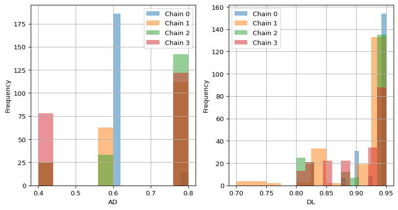

# Analyzing MCMC Runs

In this notebook we will analyze the samples of a MCMC.

We analye the evolution of MCMC runs with tree similarities in
combination with the Gelman-Rubin statistic.

## Imports

<details>
<summary>Code</summary>

``` python
## imports
import pyggdrasil as yg
import jax.numpy as jnp
import numpy as np
import jax.random as random
import pandas as pd
from pathlib import Path
import matplotlib.pyplot as plt

# matplotlib inline
%matplotlib inline 
```

</details>

## Run MCMC

Below we run 4 Markov Chains, for 100 iterations each, with different
initial trees.

### Generate a ground-truth mutation history and a noisy single-cell mutation profile

The below cell generates a random tree with 4 mutations, plus root. For
debugging we may use the *print_topo* to plot its topology.

<details>
<summary>Code</summary>

``` python
# make true tree
tree_type = yg.tree_inference.TreeType.RANDOM
mutations = 10
nodes = mutations + 1
tree_seed = 42
true_tree = yg.tree_inference.make_tree(nodes, tree_type, tree_seed) 
```

</details>

## Generate an initial tree to start the Markov Chain from

We also choose a random tree here.

<details>
<summary>Code</summary>

``` python
inital_trees = []
tree_type = yg.tree_inference.TreeType.RANDOM
for i in range(4):
    tree_seed = i
    inital_trees.append(yg.tree_inference.make_tree(nodes, tree_type, tree_seed))
```

</details>

## Generate a noisy single-cell mutation profile from the ground-truth tree

<details>
<summary>Code</summary>

``` python
## generate some little nois data
# Set up the simulation model
csm = yg.tree_inference.CellSimulationModel(
    n_cells=1000,
    n_mutations=mutations,
    fpr=0.01,
    fnr=0.2,
    na_rate=0.0,
    observe_homozygous=False,
    strategy=yg.tree_inference.CellAttachmentStrategy.UNIFORM_EXCLUDE_ROOT,
)


# Generate Data
seed = 42
rng = random.PRNGKey(seed)
data = yg.tree_inference.gen_sim_data(
    csm,
    rng,
    true_tree
    )

mut_mat = jnp.array(data['noisy_mutation_mat'])
```

</details>

    INFO:pyggdrasil.tree_inference._simulate:Generated cell-mutation data.

## Run the Markov Monte Carlo Chain

The below cell runs a 4 differnt MCMC chain. We initialize ti with the
initial tree from before. We configure the move probabilities and error
rates and run the MCMC chain for 100 iterations. The sampels are saved
to disk and loaded back into memory as chains may be very long.

``` python
mcmc_datas = []
n = 1
# run 4 chains, each with a different initial tree
for starting_tree in inital_trees:
        print("Starting MCMC for tree: ", n)
        ## Run MCMC
        # converting initial tree from TreeNode to Tree format
        init_tree_t = yg.tree_inference.Tree.tree_from_tree_node(starting_tree)

        ## file handling
        # set up save location
        save_dir = Path("")
        # make directory if it doesn't exist
        save_dir.mkdir(parents=True, exist_ok=True)
        save_name = "mcmc_test"
        full_save_name = save_dir / f"{save_name}.json"

        # make file / empty it if it exists
        with open(full_save_name, "w") as f:
            f.write("")

        # set the move probabilities and error rates
        move_probs = yg.tree_inference.MoveProbabilities()
        error_rates = yg.tree_inference.ErrorCombinations.IDEAL.value

        # run mcmc sampler
        yg.tree_inference.mcmc_sampler(
            rng_key=rng,
            data=mut_mat,
            error_rates=(error_rates.fpr, error_rates.fnr),
            move_probs=move_probs,
            num_samples=200,
            num_burn_in=0,
            out_fp=full_save_name,
            thinning=1,
            init_tree=init_tree_t,
        )

        # load the data from disk
        mcmc_data = yg.serialize.read_mcmc_samples(save_dir / f"{save_name}.json")
        # append the data to the list
        mcmc_datas.append(mcmc_data)
        #delete file
        (full_save_name).unlink()
        print("finished MCMC")
        n += 1
```

    Starting MCMC for tree:  1
    finished MCMC
    Starting MCMC for tree:  2
    finished MCMC
    Starting MCMC for tree:  3
    finished MCMC
    Starting MCMC for tree:  4
    finished MCMC

``` python
# unpack the data - reads in the serialized trees to Tree objects
# takes some time as tree objects are built and checked for validity
for i in range(len(mcmc_datas)):
    mcmc_datas[i] = yg.analyze.to_pure_mcmc_data(mcmc_datas[i])
```

## Let’s plot the log-probability of the trees over the iterations

``` python
for i in range(len(mcmc_datas)):
    plt.plot(mcmc_datas[i].iterations, mcmc_datas[i].log_probabilities)
plt.xlabel("Iteration")
plt.ylabel("Log-probability")
plt.grid()
plt.show()
```


## Let’s calculate the tree similarity over the iterations

``` python
metrics = ["AD","DL"]
base_tree = true_tree
# Create an empty list to store the results
results_AD = []
results_DL = []
for metric_name in metrics:
    metric = yg.analyze.Metrics.get(metric_name)
    for i in range(len(mcmc_datas)):
        iteration, result = yg.analyze.analyze_mcmc_run(mcmc_datas[i], metric, base_tree)
        # Append the result to the results list as a dictionary
        if metric_name == "AD":
            results_AD.append({"Iteration": iteration, "Chain": i, "AD": result})
        elif metric_name == "DL":
            results_DL.append({"Iteration": iteration, "Chain": i, "DL": result})
# Convert the results list to a pandas DataFrame
results_AD = pd.DataFrame(results_AD)
results_DL = pd.DataFrame(results_DL)
```

Let’s plot the tree similarity over the iterations

``` python
# two subplots one for the AD and one for the DL
fig, axs = plt.subplots(1, 2, figsize=(10, 5))
for i in range(len(mcmc_datas)):
    axs[0].plot(results_AD[results_AD["Chain"] == i]["Iteration"][i], results_AD[results_AD["Chain"] == i]["AD"][i], label=f"Chain {i}")
    axs[1].plot(results_DL[results_DL["Chain"] == i]["Iteration"][i], results_DL[results_DL["Chain"] == i]["DL"][i], label=f"Chain {i}")
axs[0].set_xlabel("Iteration")
axs[0].set_ylabel("AD")
axs[0].grid()
axs[0].legend()
axs[1].set_xlabel("Iteration")
axs[1].set_ylabel("DL")
axs[1].grid()
axs[1].legend()
plt.show()
```


## Let’s calculate the Gelman-Rubin statistic over the iterations

``` python
# notably this code is rather poor, but you get the usage of the api
rhat_AD = []
rhat_DL = []
for metric_name in metrics:
    # Append the result to the results list as a dictionary
    if metric_name == "AD":
        # calculate rhat - returns the 4-length array of rhats
        chains = np.array(results_AD[metric_name])
        rhat = yg.analyze.rhats(chains)
        rhat_AD.append(rhat)
    elif metric_name == "DL":
        # calculate rhat - returns the 4-length array of rhats
        chains = np.array(results_DL[metric_name])
        rhat = yg.analyze.rhats(chains)
        rhat_DL.append(rhat)
```

<details>
<summary>Code</summary>

``` python
# two subplots one for the AD and one for the DL
fig, axs = plt.subplots(1, 2, figsize=(10, 5))
for i in range(len(mcmc_datas)):
    axs[0].plot(np.arange(1,len(rhat_DL[0])+1,1), rhat_AD[0])
    axs[1].plot(np.arange(1,len(rhat_DL[0])+1,1), rhat_DL[0])
    # make horizontal lines at 1.1
    axs[0].axhline(y=1.1, color='r', linestyle='-')
    axs[1].axhline(y=1.1, color='r', linestyle='-')
axs[0].set_xlabel("Iteration")
axs[0].set_ylabel("AD")
axs[0].grid()
axs[1].set_xlabel("Iteration")
axs[1].set_ylabel("DL")
axs[1].grid()
axs[1].legend()
plt.title("Gelman-Rubin statistic on the Tree Similarity")
plt.show()
```

</details>


We see that for these few iterations we do not achive approximate
convergence defined to be below 1.1.

The posterior is definitly not well explored yet.

## Let’s visualize the trees

We visualize the posterior shape or in approximate terms the frequency
of trees sampled over the tree similarities with respect to the true
tree.

<details>
<summary>Code</summary>

``` python
# two subplots one for the AD and one for the DL
# the tree similarities on the x-axis and chains in distinct colors
fig, axs = plt.subplots(1, 2, figsize=(10, 5))
for i in range(len(mcmc_datas)):
    axs[0].hist(results_AD[results_AD["Chain"] == i]["AD"][i], label=f"Chain {i}")
    axs[1].hist(results_DL[results_DL["Chain"] == i]["DL"][i], label=f"Chain {i}")
axs[0].set_xlabel("AD")
axs[0].set_ylabel("Frequency")
axs[0].grid()
axs[0].legend()
axs[1].set_xlabel("DL")
axs[1].set_ylabel("Frequency")
axs[1].grid()
axs[1].legend()
plt.show()
```

</details>



We indeed see that the chains differ quite a lot. The chains are not
well mixed yet. None of the chains agree on the shape of the posterior.
