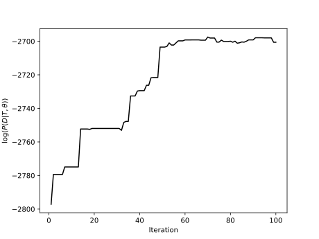
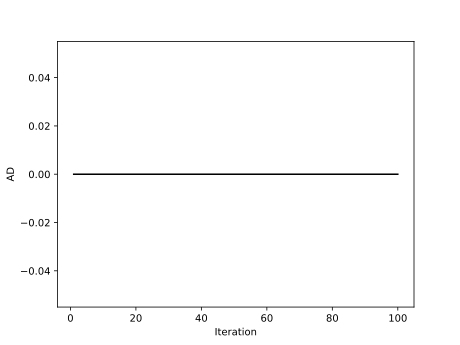

# Basic Workflows

*PYggdrasil* implements a number of basic workflows for simulated
mutation profile experiments.

We originally used these workflows as part of larger experiments to
evaluate SCITEs performance.

Here we show the workflow to run a SCITE mutation profile simulation and
inference experiment. We visualize the evolution of the chains via the
log probability and two similarity measures.

In `workflows/` we define a number of
[Snakemake](https://snakemake.readthedocs.io/en/stable/) workflows.
These workflows are defined in a modular way, so that they can be easily
combined to create more complex workflows.

- `workflows/tree_inference.smk` is the main workflow, which runs a
  mutation profile simulation and inference experiment.
- `workflows/anayze.smk` is a workflow to analyze the results of a
  simulation and inference experiment.
- `workflows/visualize.smk` is a workflow to visualize the results of a
  simulation and inference experiment.

All the `markXX` rules are used to to define more complex workflows
using these basic functionality. These experiments are defined in
`workflows/markXX.smk` and are part of
[gordonkoehn](https://github.com/gordonkoehn) thesis.

Here we show how the basic workflows can work together to run a single
MCMC chain and visualize the results. All steps of a workflow are
designed to yield intermediate results saved to the disk. Each file is
named in a unique way, so that it can be easily identified and used in
other workflows. A filename implies the complete history of generation!
(This results in long fielnames, but allows us to use pure string
mattching in snakemake – like magic.)

## Run a single MCMC chain

Here is how you would run the *mark04* workflow.

``` {zsh}
 # navigate to the workflows directory
 cd workflows
 # run the mark00 workflow  with 4 cores
 snakemake -c 4 mark00
```

Note before you can run it, you need to install *snakemake* at best in a
conda environment. See
[workflows/README.md](https://github.com/cbg-ethz/PYggdrasil/blob/main/workflows/README.md)
for more details.

*Also, you need to adjust the paths of the *DATADIR* and *REPODIR* in
*workflows/mark00.smk* and *workflows/tree_inference.smk*!*

Once you get it running: Here is what is happening the below diagram
shows the DAG of the *mark00* workflow.


This graphic was generated by the following command:

``` {zsh}
 snakemake --dag mark00 | dot -Tsvg > mark00.svg
```

The core rules here are

- gen_cell_simulation to generate a simulated mutation profile given a
  tree,

- *mcmcm* running the inference and

- *analyze_metrics* to compute the similarity metrics.

For the rest of the rules see the the individual files: \*
`workflows/tree_inference.smk` \* `workflows/anayze.smk` \*
`workflows/visualize.smk`

The full workflow generated a these three files:




Note the AD is a bad matric to visualize here, as we use a star tree as
a ground truth. No matter what the inference does, the AD will always be
0, as no ancestor-descendant relationship is present per definition of a
star tree.


