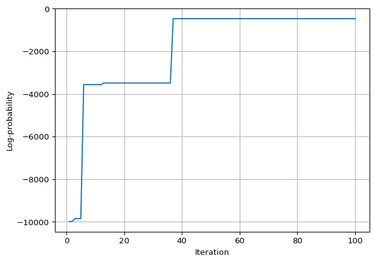

# Single MCMC Run

This tutorial shows how to run a single MCMC chain of SCITE using
PYggdrasil. - We will generate our own ground-truth mutation histroy and
generate a noisy single-cell mutation profile from it. - We will then
run a single MCMC chain to infer the mutation history from the noisy
single-cell mutation profile. - Visualize the results. The trees and the
evolution of the MCMC.

## 0) Imports

``` python
## imports
import pyggdrasil as yg
import jax.numpy as jnp
import jax.random as random
from pathlib import Path
import matplotlib.pyplot as plt

# matplotlib inline
%matplotlib inline 
```

## 1) Generate a ground-truth mutation history and a noisy single-cell mutation profile

The below cell generates a random tree with 4 mutations, plus root. For
debugging we may use the *print_topo* to plot its topology.

``` python
# make true tree
tree_type = yg.tree_inference.TreeType.RANDOM
mutations = 4
nodes = mutations + 1
tree_seed = 42
true_tree = yg.tree_inference.make_tree(nodes, tree_type, tree_seed) 

true_tree.print_topo()
```

    4
    ├── 0
    ├── 2
    │   └── 1
    └── 3

## 2) Generate an initial tree to start the Markov Chain from

We also choose a random tree here.

``` python
# make random starting tree
tree_type = yg.tree_inference.TreeType.RANDOM
tree_seed = 487
starting_tree = yg.tree_inference.make_tree(nodes, tree_type, tree_seed)
starting_tree.print_topo()
```

    4
    ├── 1
    └── 3
        ├── 0
        └── 2

## 3) Generate a noisy single-cell mutation profile from the ground-truth tree

``` python
## generate some little nois data
# Set up the simulation model
csm = yg.tree_inference.CellSimulationModel(
    n_cells=1000,
    n_mutations=mutations,
    fpr=0.01,
    fnr=0.01,
    na_rate=0.0,
    observe_homozygous=False,
    strategy=yg.tree_inference.CellAttachmentStrategy.UNIFORM_EXCLUDE_ROOT,
)


# Generate Data
seed = 42
rng = random.PRNGKey(seed)
data = yg.tree_inference.gen_sim_data(
    csm,
    rng,
    true_tree
    )

mut_mat = jnp.array(data['noisy_mutation_mat'])
print(mut_mat)
```

    [[0 0 0 ... 0 0 1]
     [1 0 0 ... 0 0 0]
     [1 1 1 ... 0 0 0]
     [0 0 0 ... 1 1 0]]

## 4) Run the Markov Monte Carlo Chain

The below cell runs a single MCMC chain. We initialize ti with the
initial tree from before. We configure the move probabilities and error
rates and run the MCMC chain for 100 iterations. The sampels are saved
to disk and loaded back into memory as chains may be very long.

``` python
## Run MCMC
# converting initial tree from TreeNode to Tree format
init_tree_t = yg.tree_inference.Tree.tree_from_tree_node(starting_tree)

## file handling
# set up save location
save_dir = Path("")
# make directory if it doesn't exist
save_dir.mkdir(parents=True, exist_ok=True)
save_name = "mcmc_test"
full_save_name = save_dir / f"{save_name}.json"
# make file / empty it if it exists
with open(full_save_name, "w") as f:
    f.write("")

# set the move probabilities and error rates
move_probs = yg.tree_inference.MoveProbabilities()
error_rates = yg.tree_inference.ErrorCombinations.IDEAL.value

# run mcmc sampler
yg.tree_inference.mcmc_sampler(
    rng_key=rng,
    data=mut_mat,
    error_rates=(error_rates.fpr, error_rates.fnr),
    move_probs=move_probs,
    num_samples=100,
    num_burn_in=0,
    out_fp=full_save_name,
    thinning=1,
    init_tree=init_tree_t,
)

# load the data from disk
mcmc_data = yg.serialize.read_mcmc_samples(save_dir / f"{save_name}.json")
#delete file
(full_save_name).unlink()
```

    INFO:pyggdrasil.tree_inference._mcmc:Move Accepted
    INFO:pyggdrasil.tree_inference._mcmc:Move Accepted
    INFO:pyggdrasil.tree_inference._mcmc:Move Rejected
    INFO:pyggdrasil.tree_inference._mcmc:Move Rejected
    INFO:pyggdrasil.tree_inference._mcmc:Move Accepted
    INFO:pyggdrasil.tree_inference._mcmc:Move Rejected
    INFO:pyggdrasil.tree_inference._mcmc:Move Rejected
    INFO:pyggdrasil.tree_inference._mcmc:Move Rejected
    INFO:pyggdrasil.tree_inference._mcmc:Move Rejected
    INFO:pyggdrasil.tree_inference._mcmc:Move Rejected
    INFO:pyggdrasil.tree_inference._mcmc:Move Accepted
    INFO:pyggdrasil.tree_inference._mcmc:Move Accepted
    INFO:pyggdrasil.tree_inference._mcmc:Move Accepted
    INFO:pyggdrasil.tree_inference._mcmc:Move Rejected
    INFO:pyggdrasil.tree_inference._mcmc:Move Rejected
    INFO:pyggdrasil.tree_inference._mcmc:Move Rejected
    INFO:pyggdrasil.tree_inference._mcmc:Move Rejected
    INFO:pyggdrasil.tree_inference._mcmc:Move Rejected
    INFO:pyggdrasil.tree_inference._mcmc:Move Rejected
    INFO:pyggdrasil.tree_inference._mcmc:Move Rejected
    INFO:pyggdrasil.tree_inference._mcmc:Move Rejected
    INFO:pyggdrasil.tree_inference._mcmc:Move Rejected
    INFO:pyggdrasil.tree_inference._mcmc:Move Accepted
    INFO:pyggdrasil.tree_inference._mcmc:Move Rejected
    INFO:pyggdrasil.tree_inference._mcmc:Move Rejected
    INFO:pyggdrasil.tree_inference._mcmc:Move Rejected
    INFO:pyggdrasil.tree_inference._mcmc:Move Rejected
    INFO:pyggdrasil.tree_inference._mcmc:Move Rejected
    INFO:pyggdrasil.tree_inference._mcmc:Move Rejected
    INFO:pyggdrasil.tree_inference._mcmc:Move Rejected
    INFO:pyggdrasil.tree_inference._mcmc:Move Rejected
    INFO:pyggdrasil.tree_inference._mcmc:Move Rejected
    INFO:pyggdrasil.tree_inference._mcmc:Move Rejected
    INFO:pyggdrasil.tree_inference._mcmc:Move Rejected
    INFO:pyggdrasil.tree_inference._mcmc:Move Rejected
    INFO:pyggdrasil.tree_inference._mcmc:Move Accepted
    INFO:pyggdrasil.tree_inference._mcmc:Move Rejected
    INFO:pyggdrasil.tree_inference._mcmc:Move Rejected
    INFO:pyggdrasil.tree_inference._mcmc:Move Rejected
    INFO:pyggdrasil.tree_inference._mcmc:Move Accepted
    INFO:pyggdrasil.tree_inference._mcmc:Move Accepted
    INFO:pyggdrasil.tree_inference._mcmc:Move Accepted
    INFO:pyggdrasil.tree_inference._mcmc:Move Rejected
    INFO:pyggdrasil.tree_inference._mcmc:Move Rejected
    INFO:pyggdrasil.tree_inference._mcmc:Move Accepted
    INFO:pyggdrasil.tree_inference._mcmc:Move Accepted
    INFO:pyggdrasil.tree_inference._mcmc:Move Rejected
    INFO:pyggdrasil.tree_inference._mcmc:Move Rejected
    INFO:pyggdrasil.tree_inference._mcmc:Move Rejected
    INFO:pyggdrasil.tree_inference._mcmc:Move Rejected
    INFO:pyggdrasil.tree_inference._mcmc:Move Rejected
    INFO:pyggdrasil.tree_inference._mcmc:Move Rejected
    INFO:pyggdrasil.tree_inference._mcmc:Move Rejected
    INFO:pyggdrasil.tree_inference._mcmc:Move Rejected
    INFO:pyggdrasil.tree_inference._mcmc:Move Rejected
    INFO:pyggdrasil.tree_inference._mcmc:Move Accepted
    INFO:pyggdrasil.tree_inference._mcmc:Move Accepted
    INFO:pyggdrasil.tree_inference._mcmc:Move Rejected
    INFO:pyggdrasil.tree_inference._mcmc:Move Rejected
    INFO:pyggdrasil.tree_inference._mcmc:Move Rejected
    INFO:pyggdrasil.tree_inference._mcmc:Move Rejected
    INFO:pyggdrasil.tree_inference._mcmc:Move Rejected
    INFO:pyggdrasil.tree_inference._mcmc:Move Accepted
    INFO:pyggdrasil.tree_inference._mcmc:Move Accepted
    INFO:pyggdrasil.tree_inference._mcmc:Move Rejected
    INFO:pyggdrasil.tree_inference._mcmc:Move Accepted
    INFO:pyggdrasil.tree_inference._mcmc:Move Rejected
    INFO:pyggdrasil.tree_inference._mcmc:Move Accepted
    INFO:pyggdrasil.tree_inference._mcmc:Move Rejected
    INFO:pyggdrasil.tree_inference._mcmc:Move Rejected
    INFO:pyggdrasil.tree_inference._mcmc:Move Rejected
    INFO:pyggdrasil.tree_inference._mcmc:Move Rejected
    INFO:pyggdrasil.tree_inference._mcmc:Move Rejected
    INFO:pyggdrasil.tree_inference._mcmc:Move Rejected
    INFO:pyggdrasil.tree_inference._mcmc:Move Accepted
    INFO:pyggdrasil.tree_inference._mcmc:Move Rejected
    INFO:pyggdrasil.tree_inference._mcmc:Move Rejected
    INFO:pyggdrasil.tree_inference._mcmc:Move Rejected
    INFO:pyggdrasil.tree_inference._mcmc:Move Accepted
    INFO:pyggdrasil.tree_inference._mcmc:Move Rejected
    INFO:pyggdrasil.tree_inference._mcmc:Move Rejected
    INFO:pyggdrasil.tree_inference._mcmc:Move Accepted
    INFO:pyggdrasil.tree_inference._mcmc:Move Rejected
    INFO:pyggdrasil.tree_inference._mcmc:Move Rejected
    INFO:pyggdrasil.tree_inference._mcmc:Move Rejected
    INFO:pyggdrasil.tree_inference._mcmc:Move Rejected
    INFO:pyggdrasil.tree_inference._mcmc:Move Accepted
    INFO:pyggdrasil.tree_inference._mcmc:Move Accepted
    INFO:pyggdrasil.tree_inference._mcmc:Move Rejected
    INFO:pyggdrasil.tree_inference._mcmc:Move Rejected
    INFO:pyggdrasil.tree_inference._mcmc:Move Rejected
    INFO:pyggdrasil.tree_inference._mcmc:Move Accepted
    INFO:pyggdrasil.tree_inference._mcmc:Move Rejected
    INFO:pyggdrasil.tree_inference._mcmc:Move Rejected
    INFO:pyggdrasil.tree_inference._mcmc:Move Rejected
    INFO:pyggdrasil.tree_inference._mcmc:Move Rejected
    INFO:pyggdrasil.tree_inference._mcmc:Move Rejected
    INFO:pyggdrasil.tree_inference._mcmc:Move Rejected
    INFO:pyggdrasil.tree_inference._mcmc:Move Rejected
    INFO:pyggdrasil.tree_inference._mcmc_sampler:Finished MCMC sampler.

## 5) Visualize the results

In the following we would like to plot the evolution of the MCMC chain
and the trees that were sampled. First we convert the data from the
serialized format to a *pureMCMCdata* format. This is a simple dataclass
that contains the trees and the log probabilities of the trees.

``` python
# unpack the data - reads in the serialized trees to Tree objects
# takes some time as tree objects are built and checked for validity
mcmc_samples = yg.analyze.to_pure_mcmc_data(mcmc_data)
```

    DEBUG:pyggdrasil.analyze._utils:converting sample of index: 0
    DEBUG:pyggdrasil.analyze._utils:converting sample of index: 1
    DEBUG:pyggdrasil.analyze._utils:converting sample of index: 2
    DEBUG:pyggdrasil.analyze._utils:converting sample of index: 3
    DEBUG:pyggdrasil.analyze._utils:converting sample of index: 4
    DEBUG:pyggdrasil.analyze._utils:converting sample of index: 5
    DEBUG:pyggdrasil.analyze._utils:converting sample of index: 6
    DEBUG:pyggdrasil.analyze._utils:converting sample of index: 7
    DEBUG:pyggdrasil.analyze._utils:converting sample of index: 8
    DEBUG:pyggdrasil.analyze._utils:converting sample of index: 9
    DEBUG:pyggdrasil.analyze._utils:converting sample of index: 10
    DEBUG:pyggdrasil.analyze._utils:converting sample of index: 11
    DEBUG:pyggdrasil.analyze._utils:converting sample of index: 12
    DEBUG:pyggdrasil.analyze._utils:converting sample of index: 13
    DEBUG:pyggdrasil.analyze._utils:converting sample of index: 14
    DEBUG:pyggdrasil.analyze._utils:converting sample of index: 15
    DEBUG:pyggdrasil.analyze._utils:converting sample of index: 16
    DEBUG:pyggdrasil.analyze._utils:converting sample of index: 17
    DEBUG:pyggdrasil.analyze._utils:converting sample of index: 18
    DEBUG:pyggdrasil.analyze._utils:converting sample of index: 19
    DEBUG:pyggdrasil.analyze._utils:converting sample of index: 20
    DEBUG:pyggdrasil.analyze._utils:converting sample of index: 21
    DEBUG:pyggdrasil.analyze._utils:converting sample of index: 22
    DEBUG:pyggdrasil.analyze._utils:converting sample of index: 23
    DEBUG:pyggdrasil.analyze._utils:converting sample of index: 24
    DEBUG:pyggdrasil.analyze._utils:converting sample of index: 25
    DEBUG:pyggdrasil.analyze._utils:converting sample of index: 26
    DEBUG:pyggdrasil.analyze._utils:converting sample of index: 27
    DEBUG:pyggdrasil.analyze._utils:converting sample of index: 28
    DEBUG:pyggdrasil.analyze._utils:converting sample of index: 29
    DEBUG:pyggdrasil.analyze._utils:converting sample of index: 30
    DEBUG:pyggdrasil.analyze._utils:converting sample of index: 31
    DEBUG:pyggdrasil.analyze._utils:converting sample of index: 32
    DEBUG:pyggdrasil.analyze._utils:converting sample of index: 33
    DEBUG:pyggdrasil.analyze._utils:converting sample of index: 34
    DEBUG:pyggdrasil.analyze._utils:converting sample of index: 35
    DEBUG:pyggdrasil.analyze._utils:converting sample of index: 36
    DEBUG:pyggdrasil.analyze._utils:converting sample of index: 37
    DEBUG:pyggdrasil.analyze._utils:converting sample of index: 38
    DEBUG:pyggdrasil.analyze._utils:converting sample of index: 39
    DEBUG:pyggdrasil.analyze._utils:converting sample of index: 40
    DEBUG:pyggdrasil.analyze._utils:converting sample of index: 41
    DEBUG:pyggdrasil.analyze._utils:converting sample of index: 42
    DEBUG:pyggdrasil.analyze._utils:converting sample of index: 43
    DEBUG:pyggdrasil.analyze._utils:converting sample of index: 44
    DEBUG:pyggdrasil.analyze._utils:converting sample of index: 45
    DEBUG:pyggdrasil.analyze._utils:converting sample of index: 46
    DEBUG:pyggdrasil.analyze._utils:converting sample of index: 47
    DEBUG:pyggdrasil.analyze._utils:converting sample of index: 48
    DEBUG:pyggdrasil.analyze._utils:converting sample of index: 49
    DEBUG:pyggdrasil.analyze._utils:converting sample of index: 50
    DEBUG:pyggdrasil.analyze._utils:converting sample of index: 51
    DEBUG:pyggdrasil.analyze._utils:converting sample of index: 52
    DEBUG:pyggdrasil.analyze._utils:converting sample of index: 53
    DEBUG:pyggdrasil.analyze._utils:converting sample of index: 54
    DEBUG:pyggdrasil.analyze._utils:converting sample of index: 55
    DEBUG:pyggdrasil.analyze._utils:converting sample of index: 56
    DEBUG:pyggdrasil.analyze._utils:converting sample of index: 57
    DEBUG:pyggdrasil.analyze._utils:converting sample of index: 58
    DEBUG:pyggdrasil.analyze._utils:converting sample of index: 59
    DEBUG:pyggdrasil.analyze._utils:converting sample of index: 60
    DEBUG:pyggdrasil.analyze._utils:converting sample of index: 61
    DEBUG:pyggdrasil.analyze._utils:converting sample of index: 62
    DEBUG:pyggdrasil.analyze._utils:converting sample of index: 63
    DEBUG:pyggdrasil.analyze._utils:converting sample of index: 64
    DEBUG:pyggdrasil.analyze._utils:converting sample of index: 65
    DEBUG:pyggdrasil.analyze._utils:converting sample of index: 66
    DEBUG:pyggdrasil.analyze._utils:converting sample of index: 67
    DEBUG:pyggdrasil.analyze._utils:converting sample of index: 68
    DEBUG:pyggdrasil.analyze._utils:converting sample of index: 69
    DEBUG:pyggdrasil.analyze._utils:converting sample of index: 70
    DEBUG:pyggdrasil.analyze._utils:converting sample of index: 71
    DEBUG:pyggdrasil.analyze._utils:converting sample of index: 72
    DEBUG:pyggdrasil.analyze._utils:converting sample of index: 73
    DEBUG:pyggdrasil.analyze._utils:converting sample of index: 74
    DEBUG:pyggdrasil.analyze._utils:converting sample of index: 75
    DEBUG:pyggdrasil.analyze._utils:converting sample of index: 76
    DEBUG:pyggdrasil.analyze._utils:converting sample of index: 77
    DEBUG:pyggdrasil.analyze._utils:converting sample of index: 78
    DEBUG:pyggdrasil.analyze._utils:converting sample of index: 79
    DEBUG:pyggdrasil.analyze._utils:converting sample of index: 80
    DEBUG:pyggdrasil.analyze._utils:converting sample of index: 81
    DEBUG:pyggdrasil.analyze._utils:converting sample of index: 82
    DEBUG:pyggdrasil.analyze._utils:converting sample of index: 83
    DEBUG:pyggdrasil.analyze._utils:converting sample of index: 84
    DEBUG:pyggdrasil.analyze._utils:converting sample of index: 85
    DEBUG:pyggdrasil.analyze._utils:converting sample of index: 86
    DEBUG:pyggdrasil.analyze._utils:converting sample of index: 87
    DEBUG:pyggdrasil.analyze._utils:converting sample of index: 88
    DEBUG:pyggdrasil.analyze._utils:converting sample of index: 89
    DEBUG:pyggdrasil.analyze._utils:converting sample of index: 90
    DEBUG:pyggdrasil.analyze._utils:converting sample of index: 91
    DEBUG:pyggdrasil.analyze._utils:converting sample of index: 92
    DEBUG:pyggdrasil.analyze._utils:converting sample of index: 93
    DEBUG:pyggdrasil.analyze._utils:converting sample of index: 94
    DEBUG:pyggdrasil.analyze._utils:converting sample of index: 95
    DEBUG:pyggdrasil.analyze._utils:converting sample of index: 96
    DEBUG:pyggdrasil.analyze._utils:converting sample of index: 97
    DEBUG:pyggdrasil.analyze._utils:converting sample of index: 98
    DEBUG:pyggdrasil.analyze._utils:converting sample of index: 99

Now, we may plot it.

``` python
plt.plot(mcmc_samples.iterations, mcmc_samples.log_probabilities)
plt.xlabel("Iteration")
plt.ylabel("Log-probability")
plt.grid()
plt.show()
```



This log-probability quickly improved for such a small tree - SCITE
works.
